# **Table of Contents**

1. Install Raspberry Pi OS onto a MicroSD Card
2. Setup the Raspberry Pi
3. Installing the Vuforia Spatial Edge Server
4. Getting Onshape API Keys
5. Running the Server
6. Connecting the Spike Prime
7. Using the Vuforia Spatial Toolbox App
8. Placing Checkpoints

# **Step 1: Install Raspberry Pi OS onto a MicroSD Card**

- Go to [www.raspberrypi.org/software/](https://www.raspberrypi.org/software/) and download the Raspberry Pi Imager that works with your machine.
- Install the Raspberry Pi Imager and open it.
  - If you have a Mac and security preferences stop you from opening it, navigate to the Applications folder in Finder and right-click on the Imager to open it. You should then have the option to open it and disregard the warning.
- Click on the Choose OS button and select the Raspberry Pi OS (32-bit).

- Choose the SD card you want to flash the image to.
  - If you don't see your SD card, make sure it is plugged in properly. Check Finder or File Explorer to see if it appears on your machine.
- Click the "Write" button to flash the image to the SD card. This may take a few minutes.

# **Step 2: Setup the Raspberry Pi**

Note: If you have previously set up a Raspberry Pi and have a preferred method, feel free to use that one. This is just one method.

- If you have a USB keyboard, USB mouse, and either a HDMI cord for the 3 Series or a micro HDMI cord for the 4 Series to connect to a display, you should be able to access the Raspberry Pi as if it was a Linux machine. Follow these steps:
  - Insert the microSD card into the bottom of the Raspberry Pi.

  - Provide power to the Raspberry Pi (MicroUSB for the 3 Series, USB-C for the 4 series).
  - Connect your peripherals (keyboard, mouse, and display). You should see a screen resembling the desktop of a Linux machine. This is your Raspberry Pi's desktop.
  - Connect to your Wi-Fi network in the upper right-hand corner of the screen.
- If you do not have one of those 3 peripherals, follow these steps:
  - Open the SD card in Finder or File Explorer so we can access the files.
  - Create a new file called "ssh" with no extention. This will enable ssh into the Raspberry Pi by default.
  - Create a file named "wpa\_supplicant.conf". In this file paste the following code:

country=US

ctrl\_interface=DIR=/var/run/wpa\_supplicant

GROUP=netdev

update\_config=1

network={

ssid="your\_wifi\_ssid"

scan\_ssid=1

psk="your\_wifi\_password"

key\_mgmt=WPA-PSK

}

  - Change the strings "your\_wifi\_ssid" to your Wi-Fi network's name and "your\_wifi\_password" to your Wi-Fi network's password.
  - Save these two files and eject the SD card from your computer.
  - Insert the microSD card into your Raspberry Pi (see picture above for reference).
  - Provide power to the Raspberry Pi (MicroUSB for the 3 Series, USB-C for the 4 series).
  - Open terminal on Mac or Command Prompt on Windows. Run the command "ping raspberrypi.local".
  - You should see the IP address of the Raspberry Pi appear. Provided this is the only Raspberry Pi on your network, this is the one you want to connect to.

  - You can now run the command "ssh pi@192.168.7.131" (replace with your IP address). It will ask you for the password, which by default is "raspberry".

  - You are now successfully ssh'd into the Raspberry Pi. Run the command "sudo raspi-config". This will allow you to change some settings of the Raspberry Pi. You should see the screen below.

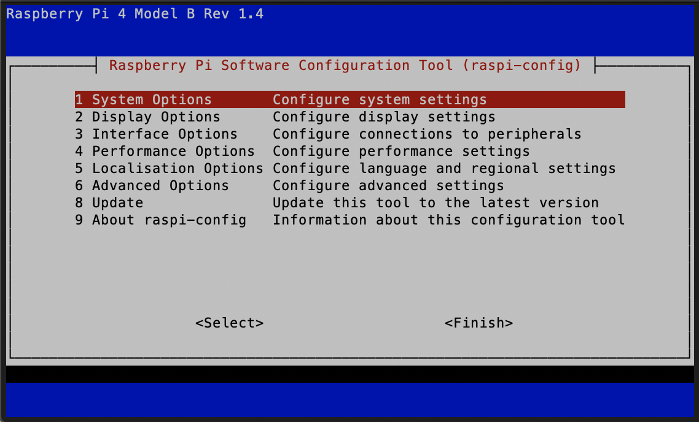

  - Navigating using the arrow keys, select "Display Options" by hitting Enter. Select "Resolution" and then select "DMT Mode 82 1920x1080 60Hz 16:9". Finally, select "Ok" at the bottom. This sets the resolution of the Raspberry Pi to 1080p, which most ssh viewers require.
  - It would also be wise to change your password. At the original configuration screen, select "System Options", followed by "Password". This will allow you to enter a new password for your Pi.
  - You may now select "Finish" and close the Terminal or Command Prompt window.
  - While not strictly necessary, a ssh viewer is very helpful for seeing what is happening within the Raspberry Pi. One view is VNC Viewer, downloadable here: [www.realvnc.com/en/connect/download/viewer/](https://www.realvnc.com/en/connect/download/viewer/).
  - Once you install VNC Viewer, open the application. You can search for an IP address to connect to. Search for your Pi's IP address and hit Enter.

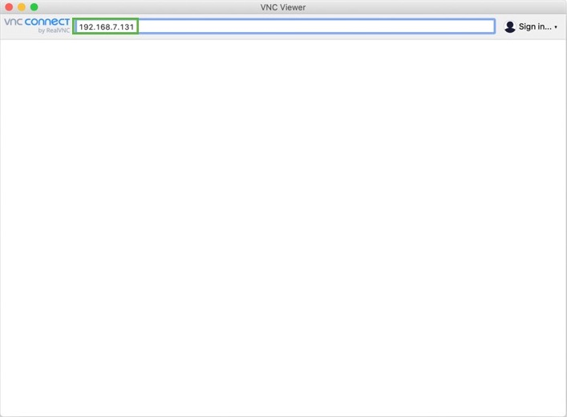

  - You should receive a pop-up that asks you to input the device's username and password. The default username is "pi" and the default password is "raspberry".
  - You should now see the Raspberry Pi's desktop.
- Your Raspberry Pi should now be setup and you should be able to access the Desktop.

# **Step 3: Installing the Vuforia Spatial Edge Server**

- On the Raspberry Pi, open the web browser and go to this link: [https://drive.google.com/file/d/1CLea\_bsk0d81IvU6zzFXJFLZLabyAf\_N/view?usp=sharing](https://drive.google.com/file/d/1CLea_bsk0d81IvU6zzFXJFLZLabyAf_N/view?usp=sharing)
- Download the script file onto your Raspberry Pi Desktop
- Once the download is finished, open the terminal and 'cd' into your Desktop
- Type "sudo bash RPI\_Downloads.sh"
- This will run the bash file, which will download all things Spatial Toolbox related to your Raspberry Pi. It may take a few minutes to finish running the script.
- When the download finishes completely, close your terminal, and open a new terminal
- Into this new terminal, type "sudo chown –R $USER /home/pi". This will give you permissions to move, edit, and run files on your Raspberry Pi.

# **Step 4: Getting Onshape API Keys**

- Go to [dev-portal.onshape.com/keys](https://dev-portal.onshape.com/keys) and select the button in the upper right corner that says Create new API key.

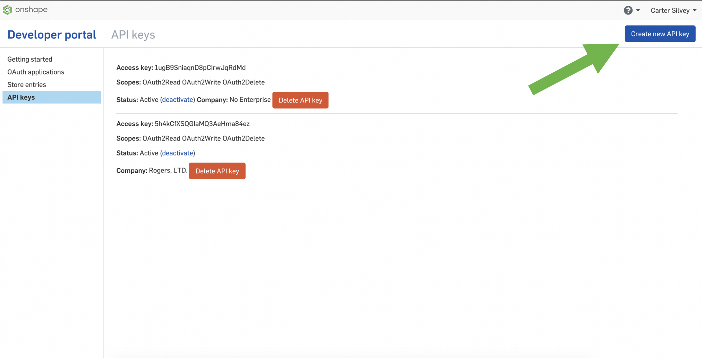

- If you are working in cad.onshape.com, select "No enterprise" for Company. If you are working in a different url, select the enterprise you are working in. Allow this API to read your documents, write to your documents, and delete your documents and workspaces. Then click the button at the bottom to create your API key.

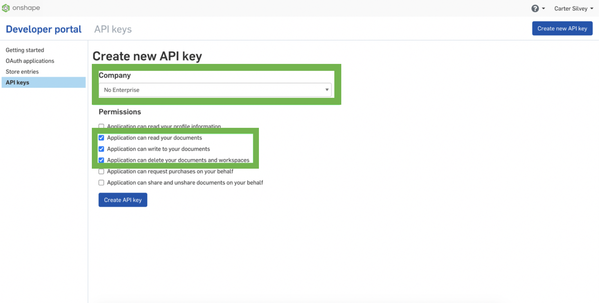

- A pop-up will display with the title "API Key Secret". This will display your access key and secret key, which you will need for all API calls. This is the only time your secret key will be displayed, so make sure you copy it.

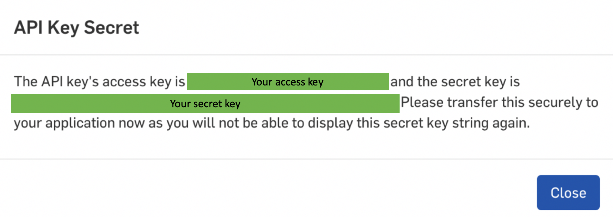

- On the Raspberry Pi, open a new terminal window. Type "cd Desktop/RaspberryPi-SpatialToolbox". Then, type "node make-keys.js".
- The terminal will prompt you to enter whether you are using an enterprise, your access key, and your secret key. You can use control+shift+v to paste in the Raspberry Pi terminal.
- Once you have set the keys without any error messages, you should be ready to run the server.

# **Step 5: Running the Server**

- Connect the Spike Prime to the Raspberry Pi using one of the USB ports on the Raspberry Pi. Power on the Spike Prime.
- On the Raspberry Pi, open a new terminal window and type "cd Desktop/RaspberyPi-SpatialToolbox/vuforia-spatial-edge-server".
- Run the command "node server" to start the server.
- Once the server begins running, you should be able to go to localhost:8080 on the Raspberry Pi's internet app to view the spatial edge server. You can also access this same page from your machine by going to the IP address of your Pi :8080. For example, 192.168.7.124:8080.
- You should see a site that looks like the picture below. If you don't, make sure the server started without errors. Click the Manage Hardware Interfaces button.

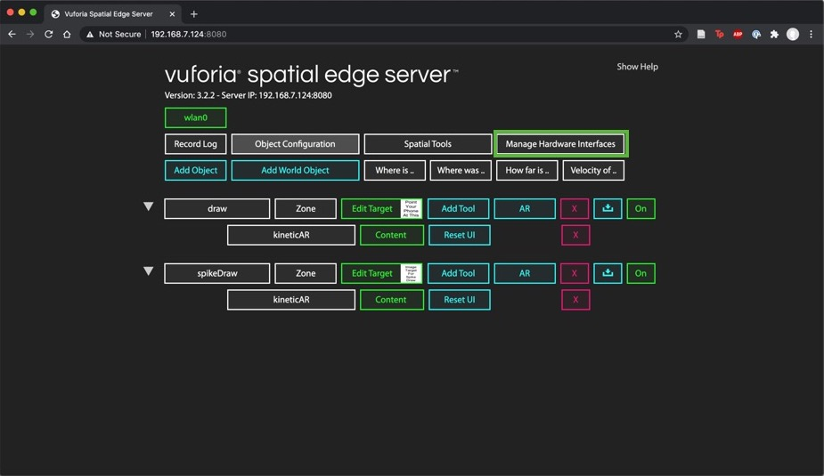

- Depending on whether you plan to use a Spike Prime or not, either turn on the Spike-Drawing interface or the Drawing interface.

- Once you have turned your desired interface on, you should see a setting wheel appear next to the interface. If you don't see one right away, try refreshing the page. Click on the settings wheel.
- There is a list of parameters you can edit here. They are as follows:
  - _drawName_ or _spikeDrawName_. This is the name of the object associated with the interface. You do not need to edit this.
  - _imageToBaseX_ (Spike only). This is the horizontal distance in millimeters from the center of your image target to the first joint of the Spike Prime robotic arm.
  - _imageToBaseY_ (Spike only). This is the vertical distance in millimeters from the center of your image target to the first joint of the Spike Prime robotic arm.
  - _link1Length_ (Spike only). This is the length in millimeters of the first linkage of the Spike Prime robotic arm. This is the length between the first and second joint of the robotic arm.
  - _link2Length_ (Spike only). This is the length in millimeters of the second linkage of the Spike Prime robotic arm. This is the length between the second joint and the end effector of the robotic arm.
  - _DocumentId._ This is the documentId of the Onshape document you wish to draw on. This is found after /document/ in the Onshape document's URL.
  - _WorkspaceId._ This is the workspaceId of the Onshape document you wish to draw on. (See step 6). This is found after /w/ in the Onshape document's URL.
  - _ElementId._ This is the elementId of the Onshape document you wish to draw on. (See step 6). This is found after /e/ in the Onshape document's URL.
  - _FeatureName_. This is the name of the feature you wish to create in Onshape.
  - _OnshapeOffsetX_. This is the horizontal distance in Onshape's units from the document origin you want to begin drawing. Note: the origin of your drawing on the Spatial Toolbox will be the center of the image target.
  - _OnshapeOffsetY_. This is the vertical distance in Onshape's units from the document origin you want to begin drawing. Note: the origin of your drawing on the Spatial Toolbox will be the center of the image target.
- Edit the parameters to suit your design, making sure to hit the save button that appears below each one to confirm your changes.
- Return to the terminal window on your Raspberry Pi and hit control+c to restart the server. This is needed to re-initialize the server with your custom parameters.

# **Step 6: Connecting the Spike Prime**

Note: if you are not using a Spike Prime you can skip this step.

- Turn the Spike Prime on and connect it to the Raspberry Pi if it is not already.
- When plugging in motors to the Spike Prime, the inverse kinematics solver requires that the motor that controls joint 1 is connected to a port alphabetically higher than the motor that controls joint 2. (If joint 2 is in port D, then joint 1 must be in port A, B, or C). If you have a third motor connected, it must be in a port below the two motors controlling the joints.
- Re-run the command "node server" within the Raspberry Pi terminal directory ~/Desktop/RaspberryPi-SpatialToolbox/vuforia-spatial-edge-server.
- After about 15-20 seconds you should see a message like the screenshot below listing the ports that the motors are connected to.

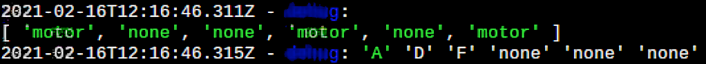

- If you do not see this message, your Spike Prime is not connected. Restart the server by hitting control+c and running "node server" again. If you still do not see this message, double check your connections and restart the Spike Prime.
- If you see the motor ports printed to the terminal, your Spike Prime has connected properly.

# **Step 7: Using the Vuforia Spatial Toolbox App**

- If you don't already have the Vuforia Spatial Toolbox App, download it from the App Store. Note: It is only available on iOS currently.

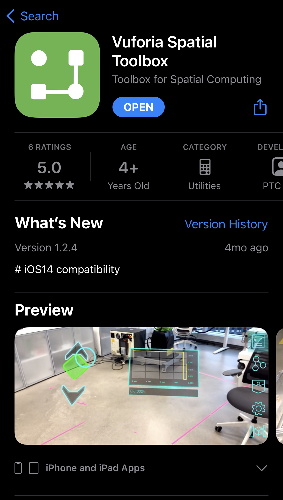

- If you want to become more familiar with the Vuforia Spatial Toolbox at any point, there is documentation here: [Spatial Toolbox Documentation](https://spatialtoolbox.vuforia.com/docs/use). The Tufts CEEO also created some tutorials on using the Spatial Toolbox here: [CEEO Innovations YouTube Playlist](https://www.youtube.com/watch?v=3wkmBDgpb34&list=PLhL0fv9JyKMaWhaHmm21J6mgpp841zYYw).
- Open the app. You should see on the right side of your screen 5 buttons. The 4th one down is the Settings button. Click on the Settings button.
- You should see a variety of settings, click on the one that says Develop.

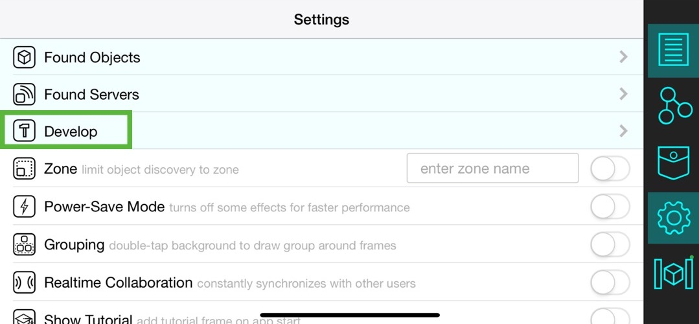

- In Develop, there will be a setting called Discovery Server where you can input an IP Address followed by a port binding.
  - You can find the server's port by running "node server" in the Raspberry Pi terminal. Search the terminal for "UDP listening on port:". The number that follows is the port number.

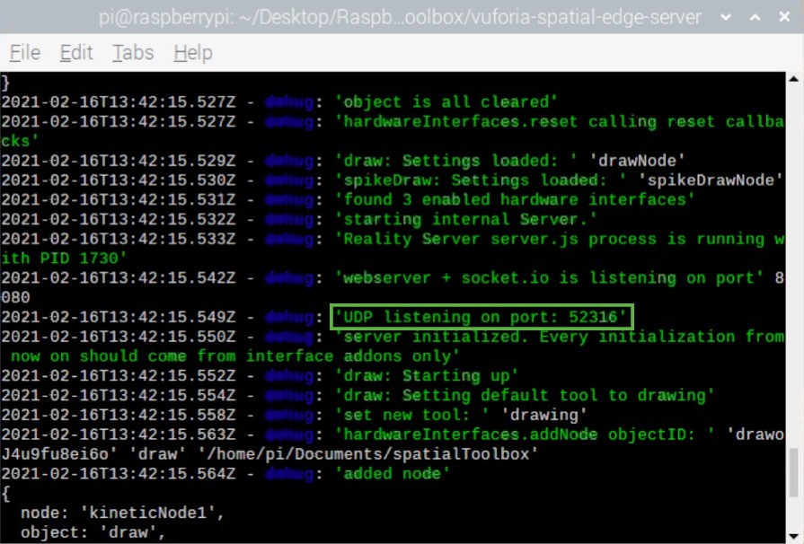

- Input the IP Address of your Raspberry Pi followed by the port it is running the server on. For example, mine is 192.168.7.124:52316.
- Toggle the switch next to the IP address so that it is in the on position.
- Also input this string into the setting called Interface URL and toggle the switch next to it.

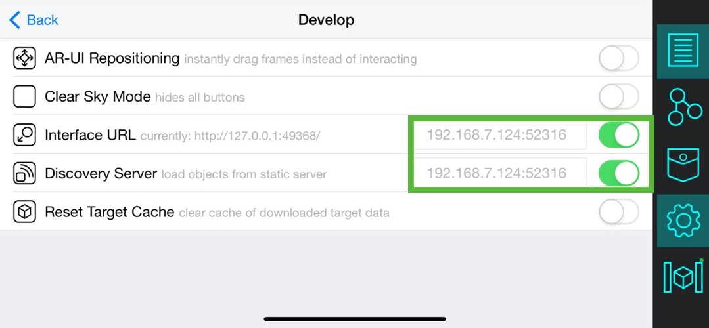

- This forces the app to connect to the server run by your Raspberry Pi. Close out of the settings by tapping the Settings button again.

# **Step 8: Placing Checkpoints**

- If it is not already running, run the server by going to the Raspberry Pi terminal and running "node server".
  - If you are using the Spike Prime, make sure that it connects properly, as described in step 6.
- Open the Vuforia Spatial Toolbox App on your phone and once it loads, point your phone at the image target for the interface you want to use.
  - If you are using the Spike Prime, make sure the Spike connects before you open the app.

 

- You should see three white cubes appear on the image target. One of the cubes is placed on the center of your image target. Another is placed at the origin for the checkpoints you will be placing. These two should be close to or exactly on top of each other.
- The third white cube is the location of the ground plane for the app. The exact position of this cube doesn't matter, but it is important that the ground plane is on the same plane as the surface of where you will be placing checkpoints.
  - You can see in the examples below that the ground plane cube looks larger than the other two because it is floating. If you tilt your camera to look at a side view, you will see the cube floating above the ground.
  - If your ground plane is floating in the air, close the app. Position your phone close to the surface you will be placing checkpoints on and reopen the app. Slowly pan over to your image target. You should see the third white cube closer to where you want it.

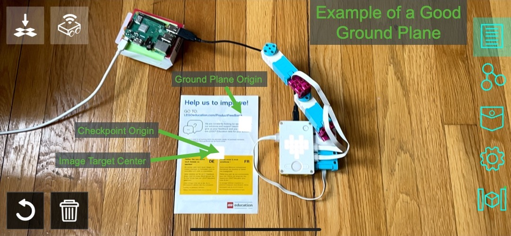

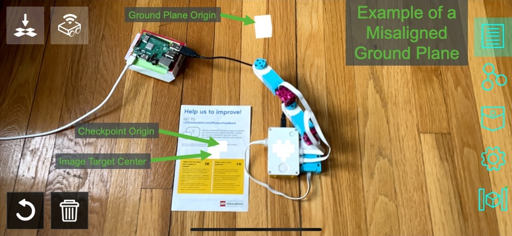

- Once you have your ground plane cube properly positioned, you're ready to place down checkpoints.
- Wait a few seconds for the interface to load. You will be able to tell the interface is fully loaded once the second icon in the top left corner becomes opaque.

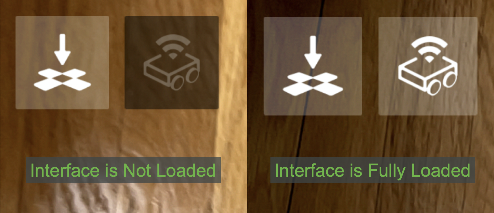

- Once your interface is fully loaded, tap on the screen to place checkpoints down. If you aren't using a Spike Prime, you should see the checkpoints appear in the Onshape document as you place them.
  - You can click the trash button in the bottom left corner to clear the checkpoints at any time. This will also remove the spline from Onshape if you are not using a Spike Prime.
- If you are using a Spike Prime, you can place the checkpoints and move them as you please. When you want the Spike Prime to move to each checkpoint, go into the Pocket and add an On Button to the experience.

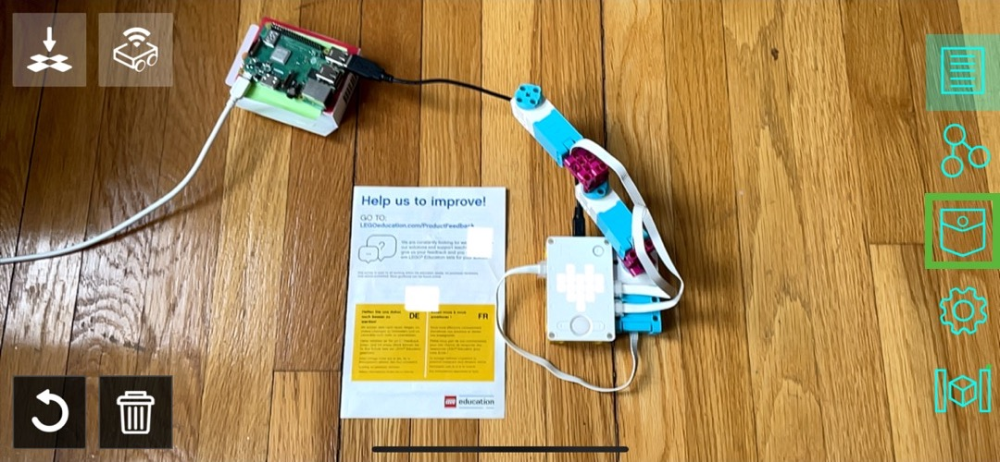

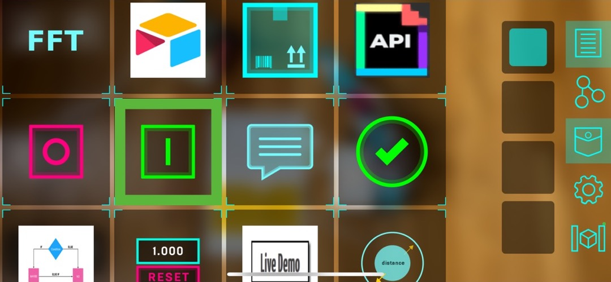

- You can then click on the Programming tab to see the nodes of each checkpoint and the On Button.
  - If for some reason you don't see nodes on the checkpoints, try restarting the server on your Raspberry Pi.
- Drag from the node of the On Button to the node of the first checkpoints, labelled "checkpoint\_0:0".
- Once the two nodes are connected, click on the Interfaces button in the top right corner to exit the programming mode.
- Click the On Button to start the Spike Prime arm. As the arm reaches each checkpoint, you should see the points added in Onshape as well.

